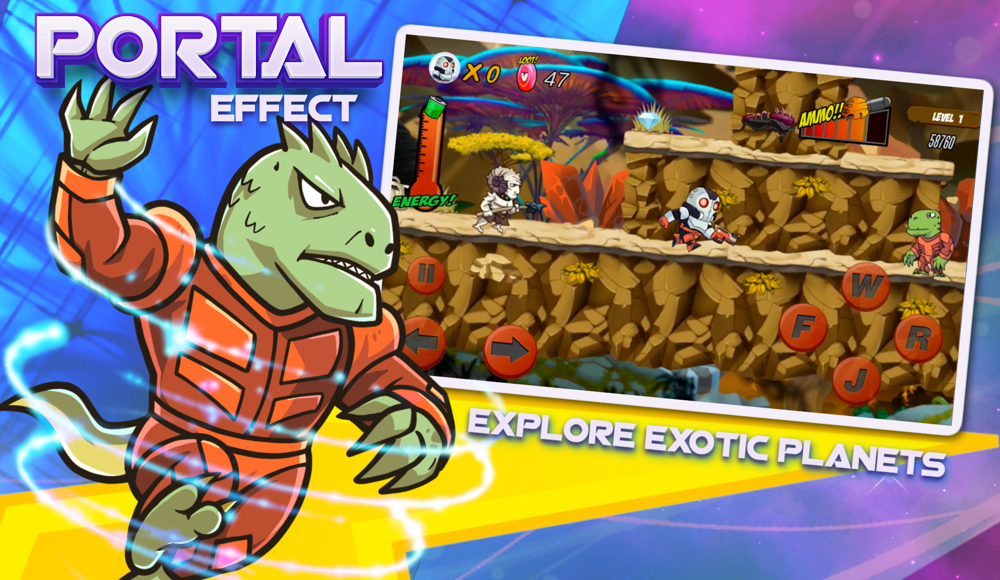
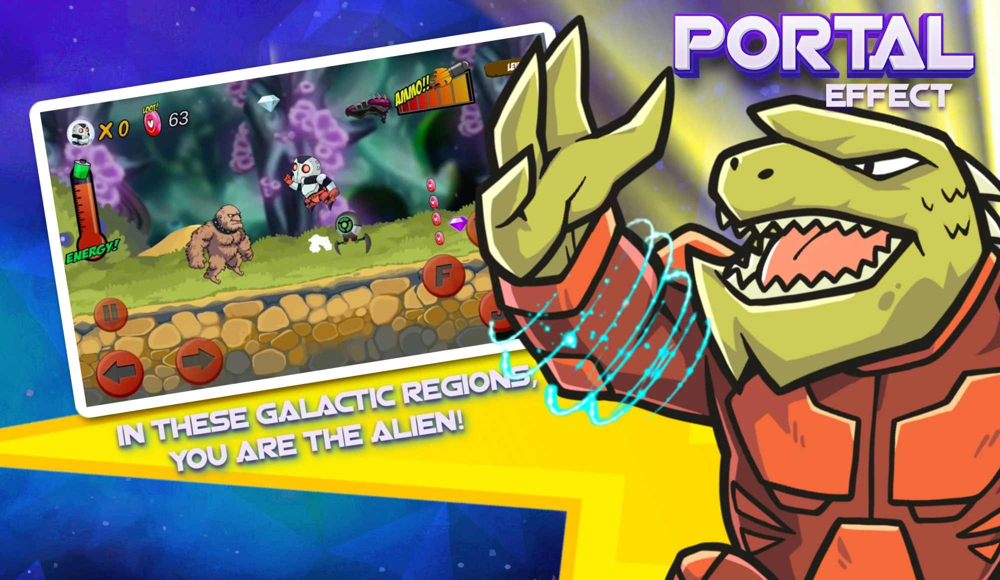

# 🎮 Ninja Fury: Shadow Warrior

## 📌 Overview
Ninja Fury: Shadow Warrior is an action-packed 2D platformer game developed using Unity. The game places players in the role of a legendary ninja warrior on a mission to rescue Koyuki while battling powerful enemies across diverse and visually rich environments.

The game combines fast-paced combat, stealth mechanics, and immersive level design to deliver an engaging gameplay experience.

---

## 🚀 Features
- ⚔️ Intense ninja combat with combo-based attacks  
- 🥷 Stealth mechanics and precision gameplay  
- 🌍 7 unique environments (Jungle, Lava, Snow, Samurai battleground)  
- 👹 Boss battles with unique enemies (Ronin, Tengu, Shogun, Ghost Samurai)  
- 📜 Skill upgrade system using sacred scrolls  
- 🎮 Smooth and responsive controls  
- 💰 In-app purchases and monetization system  

---

## 🛠️ Technologies Used
- Unity (2D Game Development)
- C#
- Android SDK
- Firebase 
- AdMob (Monetization)

---

## 🎯 My Role
- Designed and developed complete gameplay mechanics  
- Implemented combat system and enemy AI  
- Developed level progression system and environments  
- Integrated UI/UX for smooth player interaction  
- Implemented monetization (Ads & In-App Purchases)  
- Optimized game performance for Android devices  

---

## 📱 Play Store Link
https://play.google.com/store/apps/details?id=com.rexenterprises.ninjafury

---

## ▶️ Gameplay Demo
https://www.youtube.com/watch?v=JSGF7LwMHfs

---

## 📸 Screenshots

---

## 🎓 Teaching Value
This project can be used as a teaching example for:
- Game mechanics and player controls  
- Enemy AI implementation  
- Level design and progression  
- Mobile game optimization  
- Monetization strategies in games  

---

## 📊 App Details
- 📥 Downloads: 50,000+  
- 📅 Released: Feb 14, 2021  
- 🔄 Last Update: July 18, 2025  
- 📱 Platform: Android  
- 🎮 Genre: Action / Platformer  

---

## 📩 Contact
Muhammad Zeeshan  
📧 shani92527@gmail.com  

